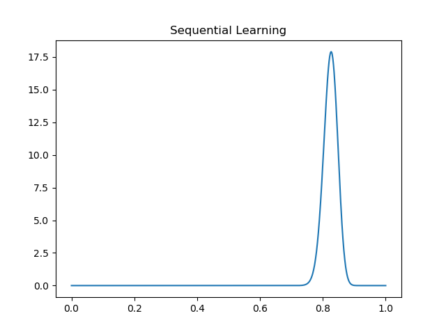
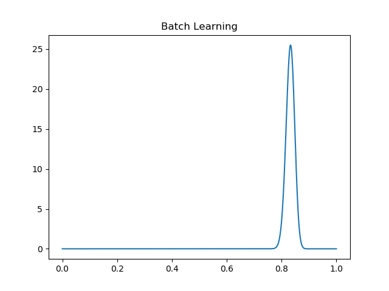

# Coin Toss Problem

## Objective
Modelling sequential learning and batch learning for a simple Bernoulli coin toss problem.

## End Models

## Conclusion
Sequential and Batch learning gives the same result.