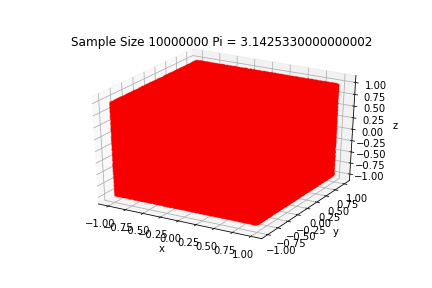

# Monte Carlo Simulation

## Objective
Modelling Monte Carlo Simulations to find area of a square and volume of a sphere

## Procedure
### 2D
Randomly plot points within a unit square. 
(pts in circle)/(pts in square) approximately equals PI/4 i.e, Ratio of areas. The ratio gets closer to PI/4 as more random points are considered.

PI Estimate: 3.141024
Error: 5.6865358e-4

### 3D
Randomly plot points within a unit cube. 
(pts in sphere)/(pts in cube) approximately equals PI/(4/3) i.e, Ratio of volumes. The ratio gets closer to PI/(4/3) as more random points are considered.

PI Estimate: 3.142533
Error: -9.4034641e-4